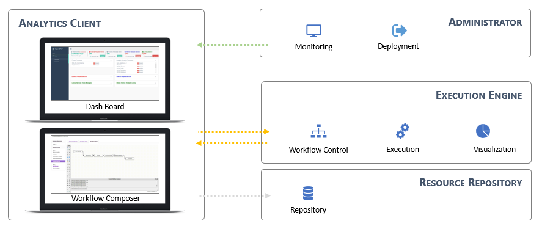
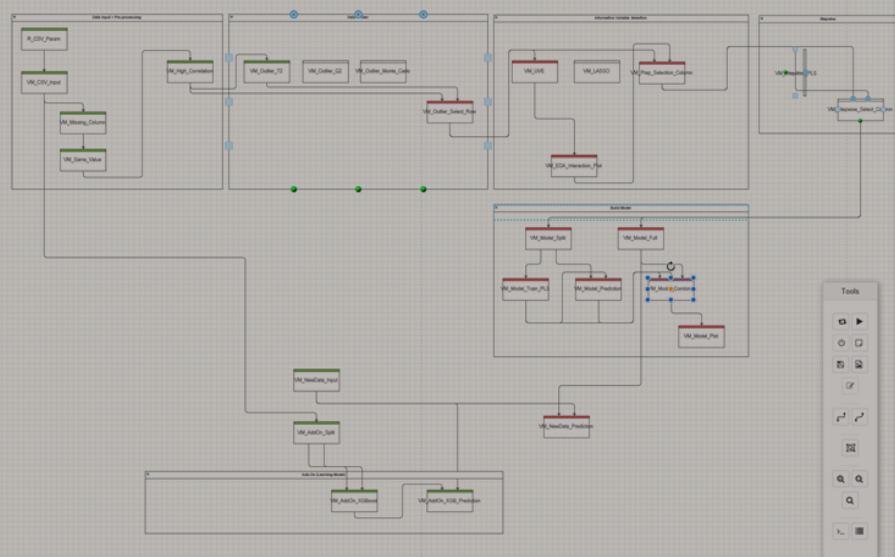

## No more uncertainty!

## Try to use BRIQUE Analytics
1. You can easily use analysis tools based on GUI environment.
2. You can implement your own algorithm with multiple language support.
3. You can increase computing performance with our distributed system.
4. You can make your own products based on our API service.

## Advantages

### 1. GUI based analysis tool

### 2. Basic and user-defined analysis library
#### Basic node
You can make your workflow based on more than 100 basic nodes.
#### Workflow reference
You can utilize preregistered workflows.

### 3. User-defined library
You can make your own library with R or Python script

### 4. Multiple language support

### 5. Distributed system and Hardware acceleration

### 6. API service for data analysis
